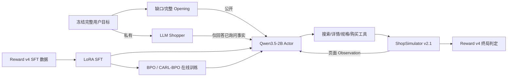

# 面向信息缺口的多轮购物 Agent 后训练

基于 Qwen3.5-2B、ShopSimulator、LoRA SFT 与在线分支策略优化，训练一个能够在用户需求不完整时
主动澄清，并继续完成搜索、核验、规格选择和购买的长程购物 Agent。

本项目的重点不是复现原参考项目的单轮 GRPO 数字，而是解决三个更具体的问题：

1. 如何让小模型先学会稳定执行长程工具工作流；
2. 如何让 Agent 在私有用户目标不可见的前提下有选择地澄清；
3. 如何用配对评测区分“真正的澄清收益”和“只是更爱提问”。

当前可复核版本使用 **ShopSimulator Environment v2.1 + Reward v4**。项目已经完成 Base、正式
Reward v4 SFT、BPO v1，以及 CARL-BPO v3 step200 的冻结 DEV-500×3 评测。v3 的正确合并模型
在三条件 strict 上达到 `982/1500 (65.5%)`，SFT-325 为 `970/1500 (64.7%)`。这是开发集上的
正向点估计；Final-200 尚未使用。

> **评测口径：** 下文 DEV-500 已被用于 checkpoint 和方案选择，因此是项目统一的冻结开发基准，
> 不是未见盲测。为了尽快形成可展示版本，本项目把它作为当前 release benchmark；不把结果描述为
> 独立 test-set 泛化。项目已从 `data/multiturn/evaluation-v2` 结果盲抽并冻结 Final-200，留给唯一
> CARL-BPO checkpoint 与 Base/SFT 的一次性最终比较。

## 核心结果

每个模型在同一批 500 个 task 上运行三个确定性条件，每格 500 条，共 1,500 条轨迹：

- **G+ / Gap + Ask**：请求缺少关键事实，允许 `ask_shopper`；
- **G− / Gap + No Ask**：使用与 G+ 相同的缺口请求，但禁止澄清；
- **C+ / Complete + Ask**：请求信息完整，仍保留澄清工具。

| 模型 | G+ strict | G− strict | C+ strict | 三条件 strict¹ | G+−G− | C+ 多余提问 | Done | Reward valid |
|---|---:|---:|---:|---:|---:|---:|---:|---:|
| Base Qwen3.5-2B | 2/500 (0.4%) | 1/500 (0.2%) | 3/500 (0.6%) | 6/1500 (0.4%) | +0.2 pp | 29/500 (5.8%) | 168/1500 | 166/1500 |
| SFT checkpoint-325 | 345/500 (69.0%) | 264/500 (52.8%) | 361/500 (72.2%) | 970/1500 (64.7%) | +16.2 pp | 469/500 (93.8%) | 1490/1500 | 1486/1500 |
| BPO v1 step-200 | 345/500 (69.0%) | 263/500 (52.6%) | 360/500 (72.0%) | 968/1500 (64.5%) | +16.4 pp | 461/500 (92.2%) | 1487/1500 | 1483/1500 |
| **CARL-BPO v3 step-200 merged** | **350/500 (70.0%)** | 264/500 (52.8%) | **368/500 (73.6%)** | **982/1500 (65.5%)** | **+17.2 pp** | **462/500 (92.4%)** | **1492/1500** | 1485/1500 |

¹ 三条件 strict 只用于描述这批 1,500 条轨迹，不作为部署总分。G+ 与 C+ 是并列主场景，G− 是配对
诊断对照。

结论：

- SFT 将三条件严格购买成功率从 **0.4% 提升到 64.7%**，把 Agent 从不稳定工具调用推进到可持续
  完成长程购买；
- SFT 的 G+ 相对 G− 高 16.2 pp，说明补充隐藏事实与更高购物成功相关；
- SFT 同时产生明显的默认提问倾向：C+ 上 93.8% 的任务至少提问一次；
- BPO v1 完成了全链路训练和审计，但没有超过 SFT：严格成功少 2/1500，平均 Reward 从 0.6010
  降至 0.5983；它把 C+ 多余提问减少了 8/500，但不足以构成总体提升。配对 strict flips 为
  18 gains / 20 losses，exact McNemar `p=0.8714`；
- 这个负结果推动了 CARL-BPO 的 Root/Local 信用分配、目标对比优先级和结构化决策阶段改造；
- CARL-BPO v3 step200 merged 相对 SFT 增加 12/1500 个 strict success：G+ `+5`、G− `0`、
  C+ `+7` 个净配对翻转，平均 Reward 从 `0.6010` 提升到 `0.6138`，同时 C+ 多余提问减少
  7/500；当前结果尚未证明统计显著性或未见任务泛化。

完整结果和证据边界见：

- [当前多轮实验结果](docs/multiturn-experiment-results.md)
- [BPO 正式训练结果](docs/bpo-formal-results.md)
- [BPO 与 SFT 的 DEV-500 配对诊断](docs/bpo-training-handoff.md)

## 系统设计



### Actor–Shopper–Environment 信息边界

| 角色 | 可以看到 | 不能做什么 |
|---|---|---|
| Actor | 公开 opening、页面观察、已经公开的 Shopper 回答 | 查看完整私有目标或 gold 商品信息 |
| Shopper | 完整用户目标、冻结 omitted facts、问答历史 | 搜索商品、替 Actor 做选择或主动泄漏未询问事实 |
| ShopSimulator | 商品状态、目标、规格、价格和 Reward | 调用 LLM 或直接撰写自然语言回答 |

Harness 负责把三者组成一条可审计轨迹，并实现：

- `ask_shopper` 与搜索、详情、规格选择、购买工具；
- Shopper 私有事实溯源和最多两次提问限制；
- Action Guard、非法动作和重复循环检测；
- 页面感知 observation 投影与 24,576-token 上下文预算；
- 环境 snapshot/clone、异常终止和 Reward 版本核对；
- 单机四 GPU 的确定性评测分片和断点恢复。

## Reward v4

Reward v4 是当前训练与评测共同使用的确定性终局标准，不调用 LLM Judge。它将用户需求编译为独立
原子：

```text
category / brand / model / core_function / option / price
```

每个原子区分 `hard / required / soft`，并根据 Actor 实际购买的 ASIN、选定 options 和最终 variant
price 判定 `pass / fail / unverifiable`。主要终局包括：

- `gold_purchase = 1.0`；
- `valid_alternative_purchase = 0.55`；
- 连续的 `partial_alternative_purchase`；
- `wrong_purchase`、`repeat_loop`、`max_steps` 和 `reward_unverifiable`。

Reward v4 不因“问了问题”自动加分，避免模型通过无条件提问获取捷径。澄清能力由 G+/G−/C+ 单独
评估。完整定义见 [Reward v4](docs/reward-v4.md)。

## 数据与 SFT

正式 SFT 数据位于 `data/sft/formal-v2`，共 1,800 条，按 task 隔离为 1,620 条训练和 180 条验证：

| 数据策略 | 行数 | Assistant token 占比 | 作用 |
|---|---:|---:|---|
| Complete no-ask | 802 | 50.22% | 学习请求完整时直接购物 |
| Composite replay | 627 | 29.91% | 提供可执行、可审计的澄清前缀 |
| Autonomous gap | 371 | 19.87% | 学习自主发现缺口并继续行动 |

所有样本从不可变 Teacher raw 轨迹重新审计，只有实际购买、规格、价格和终局同时通过 Reward v4 的
轨迹才能进入正式数据。SFT 使用 action-only loss，只监督 Assistant 的文本和工具动作，不对用户消息
或环境 observation 计算 loss。

训练基于 Qwen3.5-2B、BF16 LoRA、4×RTX 4090、24,576 最大长度和 2 epoch。开发集 sweep 证明
teacher-forcing loss 与长程成功率并不单调一致，最终选择 checkpoint-325，而不是最后一个
checkpoint-406。

详见 [SFT 文档](docs/sft.md)。

## BPO 与 CARL-BPO

### 已完成：BPO v1

BPO v1 从 SFT checkpoint-325 开始，完成：

| 项目 | 数值 |
|---|---:|
| Optimizer steps | 200/200 |
| 有效 trees / sibling returns | 400 / 1,600 |
| 总 rollout | 6,928 |
| 环境交互 | 30,255 |
| 生成回复 token | 1,478,990 |
| Shopper API 调用 | 880 |
| 4×4090 wall time | 8:57:06 |

训练、checkpoint、Reward v4 和动态采样均通过审计，但冻结 DEV-500 没有超过 SFT。这说明“训练跑完、
loss 有限、存在梯度更新”不能代替 task-level 购买结果。

### 当前候选：CARL-BPO v3 step-200 merged

CARL-BPO（Completion-Aligned Root–Local Branching Policy Optimization）是针对 BPO v1 负结果设计的
项目内改进方案，不声称是新的通用算法。核心变化包括：

- completion-aligned train return，训练 utility 与完整购买优先级对齐；
- Root K=4 全局轨迹组和 Local K=4 决策边界组；
- Root 的完整 action-level episode LOO，与 Local branch-action-only sibling LOO；
- action 内、group 内等权，并固定 Root/Local policy mass 为 `0.5/0.5`；
- Local 只有至少两个不同 canonical semantic tool action 时才可入选；
- Gold > Completion > Failure 的候选池优先级；
- product / option / search_strategy 三类结构化 Local 覆盖；
- 10批 quality search、120批应急硬停止，以及每25步 checkpoint。

v3 从 SFT-325 训练到 `global_step_200` 后人工暂停。veRL 导出目录中的顶层
`model.safetensors` 经核对仍是 SFT base，RL 更新位于 `lora_adapter/`；必须再执行 PEFT merge。
此前直接评测未合并 export 得到的“与 SFT 相同”结论无效。正确 merged 模型的 SHA-256 为
`622204f176539806e412475ef192b04700ab31112c0cc4f15748605b83dfe1f6`。

设计、两阶段导出合同和结果边界见 [CARL-BPO 文档](docs/carl-bpo.md#19-当前-v3-进度导出合同与-dev-500-结论)。

## 评测协议

当前 release 使用冻结 DEV-500 统一报告 Base、SFT、BPO v1 和 CARL-BPO v3 step200 merged。
它满足：

- 与正式 SFT、RL train/validation task ID 零重叠；
- Reward v4 gold-reachability 清洗；
- 每题固定 gap 与 complete opening；
- G+ 与 G− 共享同一 gap opening；
- 同一 Actor prompt、工具、Shopper、上下文和确定性推理参数；
- 缺失与基础设施错误保留在固定分母；
- RL 与 SFT 按 task ID 做 gains/losses 配对分析；三条件合计只作描述，不跨条件冒充独立样本。

由于 DEV-500 已参与 checkpoint 和方案选择，本项目只把它称为 **frozen development benchmark**。
后续独立 Final-200×3 和全量 Rubric/Judge 属于增强项，不阻塞当前项目展示。

两层评测的完整定义见 [多轮购物 Agent 评测协议](docs/multiturn-evaluation.md)。

## 仓库结构

```text
configs/                         SFT、BPO/CARL-BPO 与 AgentLoop 配置
data/
  sft/formal-v2/                 Reward v4 SFT train/validation
  grpo/formal-v2/                RL train/validation 与冻结 openings
  multiturn/evaluation-dev-v2/  当前 release benchmark
  multiturn/final-200-v1/       已冻结、尚未运行的独立 Final-200
docs/                            设计、训练、结果与评测协议
environments/ShopSimulator/      固定环境与商品数据
patches/                         带版本和哈希校验的 veRL 补丁
scripts/                         数据、训练、导出、评测与审计入口
src/shopping_grpo/
  collection/                    Teacher 轨迹验收和 SFT 数据构造
  environment/                   环境客户端、动作和 observation
  training/sft/                  action-only SFT
  training/grpo/                 veRL AgentLoop 与动态采样
  training/bpo/                  BPO/CARL-BPO return、mask 与信用分配
  evaluation/                    确定性指标、Rubric、Judge 和配对比较
tests/                           单元、属性、入口和运行合同测试
```

## 复现入口

项目主要面向 Linux + 4×RTX 4090。依赖版本固定在 `pyproject.toml` 和 `uv.lock`。

```bash
# 安装环境
bash scripts/setup.sh

# 启动 Reward v4 ShopSimulator
export SHOP_ENV_CONFIG="$PWD/environments/ShopSimulator/shop_env/configs/environment-v4.json"
bash scripts/start_environment.sh

# SFT
bash scripts/sft.sh

# BPO/CARL-BPO：先做不训练预检
bash scripts/bpo.sh --dry-run

# 当前 DEV-500 三条件评测
export MULTITURN_ASSET_DIR="$PWD/data/multiturn/evaluation-dev-v2"
bash scripts/evaluate_multiturn_parallel.sh MODEL_LABEL
```

LoRA RL checkpoint 不能把 `scripts/export_grpo.sh` 的输出目录直接用于 vLLM；必须继续合并其中的
`lora_adapter`。可复制命令见 [CARL-BPO 两阶段导出](docs/carl-bpo.md#193-lora-导出与合并必须是两阶段)。

正式训练和恢复操作有额外的 fail-fast 审计门槛，请按对应专题文档执行，不要只复制上述概览命令：

- [SFT](docs/sft.md)
- [GRPO/BPO 训练边界](docs/grpo.md)
- [BPO 运行手册](docs/bpo.md)
- [CARL-BPO 运行与验收](docs/carl-bpo.md)
- [评测协议](docs/multiturn-evaluation.md)
- [Final-200×3 运行手册](docs/final-200-runbook.md)

## 简历表述

> 面向用户需求不完整的长程购物任务，构建 Actor–Shopper–Environment 多轮 Agent 后训练系统，
> 完成 Reward v4 数据治理、1,800 条多策略 SFT、veRL 在线分支策略优化和 G+/G−/C+ 配对评测；
> 在冻结 DEV-500×3 基准上将严格购买成功率从 Base 的 0.4% 提升至 SFT 的 64.7%，并通过
> action-balanced Root–Local CARL-BPO v3 在 step200 达到 65.5%；完成轨迹从168/1500提升至
> 1492/1500。该数字是开发集结果，Final-200 尚未使用。

建议拆成简历 bullet 时保留以下三点：

1. `0.4% -> 64.7%` 的 SFT 结果和固定分母；
2. Actor–Shopper 私有信息边界与 G+/G−/C+ 配对评测；
3. BPO v1 没有超过 SFT，以及由此驱动的 CARL-BPO v3 在 DEV 上取得 `+12/1500` 净 strict
   改善；明确注明它不是 Final 结果。

不要把 CARL-BPO v3 的 DEV 提升写成统计显著、独立测试集或 Final-200 提升。

## 当前边界与后续工作

当前项目已经足以作为一个完整的工程与实验项目展示：它包含问题定义、数据、SFT、在线 RL、负结果
分析、改进算法、统一评测和复现合同。尚未完成的增强项为：

- 聚合100个 fixed-state correct/wrong action 的 margin delta，完成首次语义错误—RL信号归因；
- 补齐 v3 merged 的 `gold_purchase + valid_alternative_purchase` 原始计数和逐条件统计检验；
- 决定冻结 step200，还是从可恢复 checkpoint 继续到500-step上限；
- Base/SFT/选定 RL 的未见 Final-200×3；
- task bootstrap / paired bootstrap 与 McNemar 统计；
- 全量 requirement Rubric 和轨迹 Judge；
- 英文 README 与最终结果 Dashboard。

这些项目不会改变当前已经验证的 Base/SFT/BPO v1 数字，但可能改变对 v3 增益强度和泛化性的判断。

## 致谢

项目建立在 [ShopSimulator](https://arxiv.org/pdf/2601.18225)、
[veRL](https://github.com/verl-project/verl)、[Qwen](https://github.com/QwenLM/Qwen3) 和原参考仓库
[qiqihezh/agentic-grpo-longhorizon](https://github.com/qiqihezh/agentic-grpo-longhorizon)之上。
本仓库保留原参考项目的 Reward v3/Final-200 资产用于历史复现，但当前多轮 Reward v4 结果与其分栏
报告。
